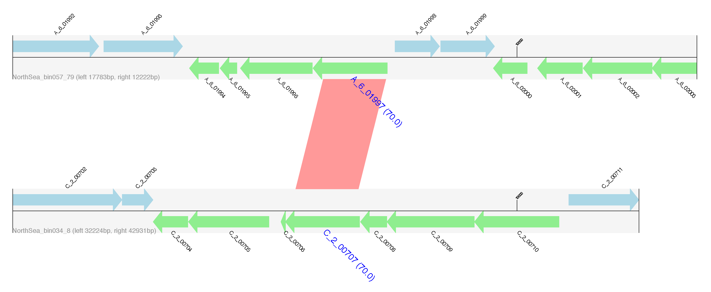
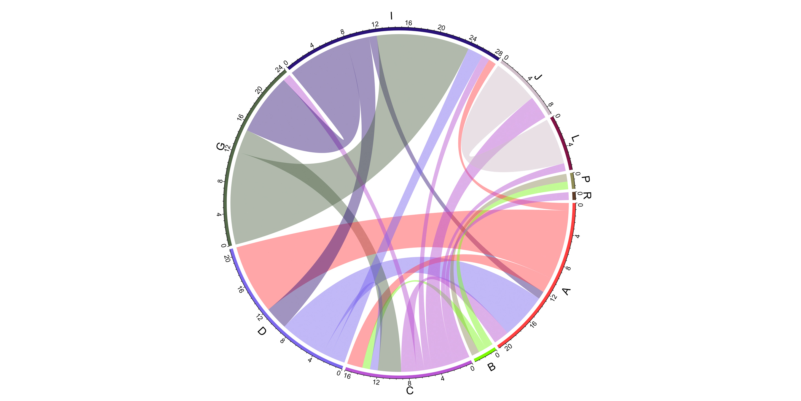

 

Publication:
---

+ **Song WZ**, Wemheuer B, Zhang S, Steensen K, Thomas T* (2019) MetaCHIP: community-level horizontal gene transfer identification through the combination of best-match and phylogenetic approaches. Microbiome. 7:36 https://doi.org/10.1186/s40168-019-0649-y
+ Contact: Weizhi Song (songwz03@gmail.com), Torsten Thomas (t.thomas@unsw.edu.au)
+ Centre for Marine Science and Innovation ([CMSI](https://www.cmsi.unsw.edu.au)), University of New South Wales, Sydney, Australia

Change Log:
---

* v1.10.0 (2020-08-16) - Fixed a few bugs
* v1.9.0 (2020-06-01) - Add supplementary module: rename_seqs
* v1.7.0 (2019-07-26) - Add supplementary modules: get_SCG_tree and SankeyTaxon
* v1.6.0 (2019-07-23) - Support customized grouping of query genomes
* v1.5.2 (2019-07-23) - Pfam hmm profiles updated to v32.0, TIGRFAMS db version is v14.0
* v1.5.0 (2019-07-19) - Add supplementary module: update_hmms
* v1.4.0 (2019-07-15) - Add supplementary module: filter_HGT
* v1.3.0 (2019-07-12) - Add supplementary module: CMLP
* v1.2.0 (2019-04-29) - Support multiple-level detections
* v1.1.0 (2019-01-19) - Support multiprocessing
* v1.0.0 (2018-12-29) - Initial release

Dependencies:
---

+ Python libraries: 
[BioPython](https://github.com/biopython/biopython.github.io/) (>=1.78 :warning::warning::warning:), 
[Numpy](http://www.numpy.org),
[SciPy](https://www.scipy.org),
[Matplotlib](http://matplotlib.org) and 
[ETE3](http://etetoolkit.org).

+ R packages: 
[optparse](https://cran.r-project.org/web/packages/optparse/index.html),
[ape](https://cran.r-project.org/web/packages/ape/index.html) and 
[circlize](https://cran.r-project.org/web/packages/circlize/index.html).

+ Third-party software: 
[Prodigal](https://github.com/hyattpd/Prodigal), 
[HMMER 3](http://hmmer.org),
[MAFFT](https://mafft.cbrc.jp/alignment/software/),
[BLAST+](https://blast.ncbi.nlm.nih.gov/Blast.cgi?PAGE_TYPE=BlastDocs&DOC_TYPE=Download),
[Ranger-DTL 2.0](https://compbio.engr.uconn.edu/software/RANGER-DTL/) (part of MetaCHIP, no need to install) and 
[FastTree](http://www.microbesonline.org/fasttree/).

How to install:
---

1. MetaCHIP can be installed via `pip3`:

        # First-time installation
        pip3 install MetaCHIP
        
        # for upgrade
        pip3 install --upgrade MetaCHIP
        
1. You can either add MetaCHIP's 3rd party dependencies to your system path or specify full path to their executables in MetaCHIP_config.py which can be found in Python's folder `lib/site-packages/MetaCHIP`.

Notes
---

:warning: Please make sure the ID of sequences/contigs in your input genomes are **LESS than 22 letters** . 
You can use the "**rename_seqs**" module to rename sequences, see more details with `MetaCHIP rename_seqs -h`.

:warning: For a realiable construction of the species tree, input genomes for MetaCHIP should be with at least **40%** completeness.

How to run:
---

1. The input files for MetaCHIP include a folder that holds the sequence file ([example](https://github.com/songweizhi/MetaCHIP/blob/master/input_file_examples/human_gut_bins))
of all query genomes, as well as a text file which provides taxonomic classification ([example](https://github.com/songweizhi/MetaCHIP/blob/master/input_file_examples/human_gut_bins_GTDB.tsv)) 
or customized grouping ([example](https://github.com/songweizhi/MetaCHIP/blob/master/input_file_examples/customized_grouping.txt))
of your input genomes. File extension of your input genomes (e.g. fa, fasta) should **NOT** be included in the taxonomy or grouping file.

1. [**GTDB-Tk**](https://github.com/Ecogenomics/GTDBTk) is recommended for taxonomic classification of input genomes. Only the first two columns ('user_genome' and 'classification') in GTDB-Tk's output file are needed. 

1. Options for argument '-r' in the PI and BP modules can be any combinations of d (domain), p (phylum), c (class), o (order), f (family), g (genus) and s(species).

1. Some examples: 
               
    * Detect HGT among classes
    
          MetaCHIP PI -p NorthSea -r c -t 6 -i bin_folder -x fasta -taxon GTDB_classifications.tsv
          MetaCHIP BP -p NorthSea -r c -t 6

    * Detect HGT among phyla, classes, orders, families and genera

          MetaCHIP PI -p NorthSea -r pcofg -t 12 -i bin_folder -x fasta -taxon GTDB_classifications.tsv
          MetaCHIP BP -p NorthSea -r pcofg -t 12

    * Detect HGT among customized groups
        
          MetaCHIP PI -p NorthSea -g customized_grouping.txt -t 6 -i NS_37bins -x fasta
          MetaCHIP BP -p NorthSea -g customized_grouping.txt -t 6

Output files:
---

1. A Tab delimited text file containing all identified HGTs. Filename format: `[prefix]_[taxon_ranks]_detected_HGTs.txt`

    |Column|Description|
    |---|---|
    |Gene_1|The 1st gene involved in a HGT event|
    |Gene_2|The 2nd gene involved in a HGT event|
    |Identity|Identity between Gene_1 and Gene_2|
    |Occurence(taxon_ranks)|Only for multiple-level detections. If you performed HGT detection at phylum, class and order levels, a number of "011" means current HGT was identified at class and order levels, but not phylum level.|
    |End_match|End match or not (see examples below)|
    |Full_length_match|Full length match or not (see examples below)|
    |Direction|The direction of gene flow. Number in parenthesis refers to the percentage of this direction being observed if this HGT was detected at multiple ranks and different directions were provided by Ranger-DTL.|   

1. Nucleotide and amino acid sequences of identified donor and recipient genes.

1. Flanking regions of identified HGTs. Genes encoded on the forward strand are displayed in light blue, and genes coded on the reverse strand are displayed in light green. The name of genes predicted to be HGT are highlighted in blue, large font with pairwise identity given in parentheses. Contig names are provided at the left bottom of the sequence tracks and numbers following the contig name refer to the distances between the gene subject to HGT and either the left or right end of the contig. Red bars show similarities of the matched regions between the contigs based on BLASTN results.
    

        
1. Gene flow between groups. Bands connect donors and recipients, with the width of the band correlating to the number of HGTs and **the colour corresponding to the donors**.
    

1. Examples of contig end matches.
       

        
1. Examples of full-length contig matches.
    

